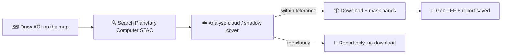
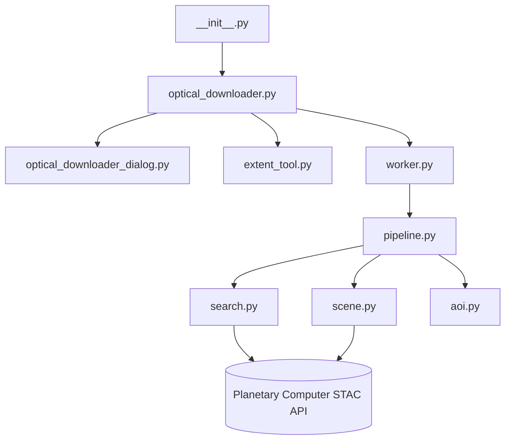

<p align="center">
  
</p>

<h1 align="center">Optical Downloader</h1>

<p align="center">Download cloud-masked Sentinel-2 and Landsat 8/9 imagery straight into QGIS.</p>

<p align="center">
  <a href="LICENSE"></a>
  
  <a href="https://optical-downloader.readthedocs.io/en/latest/?badge=latest"></a>
  
  
</p>

A QGIS 3 plugin that searches [Microsoft Planetary Computer](https://planetarycomputer.microsoft.com/)
for the least-cloudy Sentinel-2 L2A or Landsat 8/9 Collection 2 L2 scene over an area and date you
choose, applies cloud/shadow masking (SCL for Sentinel-2, QA_Pixel for Landsat), and writes a
georeferenced multi-band GeoTIFF — with a progress bar and a cloud-statistics report.

**No account or API key required.** Sentinel-2 and Landsat are in Planetary Computer's open,
public collection tier — the plugin queries the STAC API and signs asset URLs anonymously. Draw
your area of interest on the map, pick a date, click Run.



## ✨ Features

- **Two platforms** — Sentinel-2 L2A (10 m) and Landsat 8/9 Collection 2 L2 (30 m).
- **Draw-on-map AOI** — rubber-band a rectangle on the canvas, or type coordinates directly.
- **Two cloud thresholds** — a tile-level pre-filter for the STAC search, and a stricter
  AOI-specific tolerance that blocks the download outright if exceeded.
- **Configurable cloud/shadow masking** — tick which SCL / QA_Pixel flags to exclude.
- **Three band presets** — RGB only, RGB + NIR + SWIR, or all bands.
- **Runs in the background** — a `QThread` worker keeps the QGIS UI responsive, with a live
  progress bar and status messages.
- **Always writes a report** — cloud statistics are saved even when a scene is rejected for
  being too cloudy, so you know why.

## 📦 Installation

**From a ZIP file**

1. Build the ZIP with `./build_plugin.sh` (see [Development](#️-development-setup) below), or
   download a release from the [GitHub repository](https://github.com/iliasmachairas/Optical-Downloader).
2. In QGIS: **Plugins → Manage and Install Plugins → Install from ZIP**.
3. Select the ZIP and click **Install Plugin**.

**Dependencies**

Open the OSGeo4W Shell that ships with QGIS (so packages land in QGIS's own Python, not your
system one) and run:

```bash
pip install shapely requests
```

GDAL is already available to QGIS's Python in any standard QGIS install.

## 🚀 Usage

1. Open the plugin from the toolbar icon or **Plugins → Optical Downloader**.
2. Pick a **date** and a **±day search window**.
3. Choose **Sentinel-2 L2A** or **Landsat 8/9 C2 L2**.
4. Set the **cloud thresholds** (tile pre-filter and AOI tolerance) and tick which cloud/shadow
   types to mask out.
5. Click **Draw on map** and drag a rectangle, or type AOI coordinates directly
   (WGS-84 decimal degrees).
6. Choose a **band selection** and an **output folder**, then click **Run Download**.

Full walkthrough with screenshots: **[optical-downloader.readthedocs.io](https://optical-downloader.readthedocs.io)**
(source in [`docs/`](docs/) — see [Documentation](#-documentation) below for how to publish it).

### Output

| File | Description |
|---|---|
| `{PLATFORM}_{DATE}_{TILE}_report.txt` | Cloud/shadow statistics and quality metrics for the selected scene |
| `{PLATFORM}_{DATE}_{TILE}_{BAND_SELECTION}.tif` | Multi-band georeferenced GeoTIFF |

If the best available scene exceeds your cloud tolerance, only the report is written.

### Platform notes

| Platform | Collection ID | QA layer | Native resolution |
|---|---|---|---|
| Sentinel-2 L2A | `sentinel-2-l2a` | SCL (Scene Classification Layer) | 10 m |
| Landsat 8/9 C2 L2 | `landsat-c2-l2` | QA_Pixel bitmask | 30 m |

Band values follow each collection's own scaling (Sentinel-2 reflectance × 10000; Landsat
Collection 2 Level-2 scaling).

## 📖 Documentation

Full docs (installation, and a walkthrough of each option) are built with Sphinx from the
`docs/` folder — see `docs/index.rst` to read the source directly, or connect this repo at
[readthedocs.org](https://readthedocs.org) to publish it at `https://optical-downloader.readthedocs.io`.

## 🛠️ Development setup

This plugin's working copy lives directly under the QGIS profile's plugin folder, so edits take
effect on the next reload — no build/deploy step:

```
.../AppData/Roaming/QGIS/QGIS3/profiles/default/python/plugins/optical_downloader
```

Install the [Plugin Reloader](https://plugins.qgis.org/plugins/plugin_reloader/) QGIS plugin and
assign it a shortcut to reload Optical Downloader after saving changes, without restarting QGIS.

### Packaging a release ZIP

```bash
./build_plugin.sh            # build zip + git commit/push
./build_plugin.sh --no-git   # just build the zip, skip git steps
```

Drops `Optical-Downloader-<version>.zip` (version read from `metadata.txt`) in `~/Downloads`,
ready to upload at [plugins.qgis.org/plugins/add](https://plugins.qgis.org/plugins/add/).

## 🏗️ Architecture



```
__init__.py                       -> classFactory(iface)
optical_downloader.py              -> main plugin class (initGui/unload/run), wires the dialog
optical_downloader_dialog.py        -> QDialog: typed getters/setters over the Qt Designer UI
optical_downloader_dialog_base.ui    -> Qt Designer UI file
extent_tool.py                     -> rubber-band AOI drawing tool for the map canvas
worker.py                          -> QThread wrapping pipeline.py, emits progress/status/result
pipeline.py                        -> orchestrates search -> cloud analysis -> download -> save
search.py                          -> STAC query + anonymous SAS URL signing
scene.py                           -> GDAL/VSICURL streaming, reprojection, resampling, GeoTIFF write
aoi.py                             -> AOI bounding-box / GeoJSON helper
```

## ⚖️ License

GPL-2.0-or-later. See [`LICENSE`](LICENSE).

## 👤 Author

Ilias Machairas
